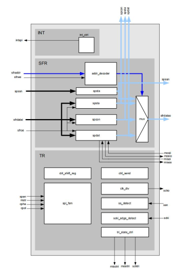

# SPI_MS
Final Project - Fa23 (a “SPI_MS Chip” that allows full-duplex, synchronous, serial communication between the Chip and peripherals.)

## Architecture

ref : http://www.wangdali.net/spi/

## Timing constraints

|                                                              | MIN      | TYP  | MAX  | UNIT |                                                              |
| ------------------------------------------------------------ | -------- | ---- | ---- | ---- | ------------------------------------------------------------ |
| 时钟描述                                                     |          |      |      |      |                                                              |
| f_clk                                                        | 24       |      |      | MHz  | 建议综合时频率设置为目标频率的0.8倍，给后端留出余量          |
| source latency                                               |          |      | 0.5  | ns   |                                                              |
| uncertainty(setup)                                           |          |      | 0.6  | ns   | set_clock_uncertainty -setup                                 |
| uncertainty(hold)                                            |          |      | 0.5  | ns   | set_clock_uncertainty -hold                                  |
| clock_transition                                             |          |      | 0.4  | ns   | set_clock_transition                                         |
|                                                              |          |      |      |      | 建议时钟设置don’t touch和ideal  network     set_dont_touch_network     set_ideal_network |
|                                                              |          |      |      |      |                                                              |
| f_scl                                                        | 400      |      |      | KHz  |                                                              |
| uncertainty(setup)                                           |          |      | 0.6  | ns   |                                                              |
| uncertainty(hold)                                            |          |      | 0.5  | ns   |                                                              |
| clock_transition                                             |          |      | 0.4  | ns   |                                                              |
|                                                              |          |      |      |      |                                                              |
| 输入输出延迟                                                 |          |      |      |      |                                                              |
| input_delay                                                  | 0        |      | 500  | ns   | 除时钟外其他端口设置输入或输出延迟                           |
| output_delay                                                 | 0        |      | 500  | ns   |                                                              |
|                                                              |          |      |      |      |                                                              |
| 输入驱动与输出负载                                           |          |      |      |      |                                                              |
| driving cell                                                 | CKNID2C  |      |      |      |                                                              |
| loading cell                                                 | CKNID12C |      |      |      |                                                              |
|                                                              |          |      |      |      |                                                              |
| 其他约束自行按需要设置                                       |          |      |      |      |                                                              |
| 1、不同时钟域之间信号进行交互需进行跨时钟域同步并按需设置多周期(set_multicycle_path)，同步后不同时钟域之间不再进行跨时钟域检查(设置set_false_path)。     2、其他约束自行按需要设置。 |          |      |      |      |                                                              |

## git tutorial

https://www.liaoxuefeng.com/wiki/896043488029600
